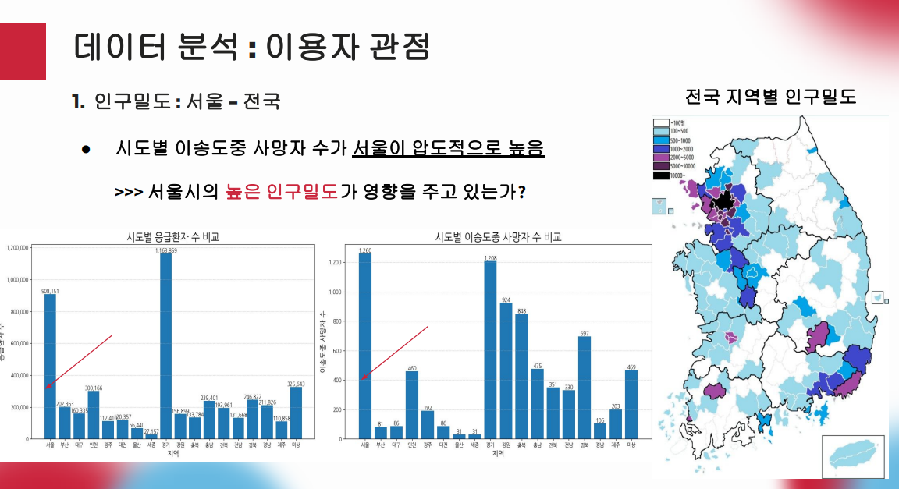
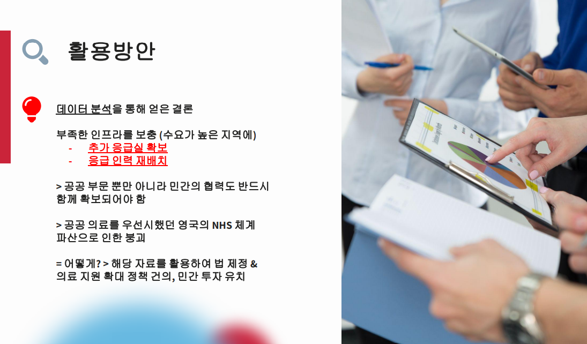

# Alpaco
서울시 추가 응급실 공급과 인력 재배치를 통한 사망자 수 최소화

# 🌃 프로젝트 개요

:star: **프로젝트 이름** :   데이터분석을 통한 서울시 응급 시스템 개선
:clock1: **프로젝트 기간** : 2023.8.14 ~ 2023.8.28 
:department_store: **팀원** : 강동완, 김시온, 김영훈 

## 📘 의도 및 방향
매년 전국에서 구급차 뱅뱅이로 인한 사망사고가 발생하고 있다.

구급차 뱅뱅이란 응급사고가 발생한 뒤 환자를 이송하는 과정에서
여러 병원들이 의사부족, 시설 부족등의 이유로 치료를 거부하여
환자가 구급차안에서 병원을 찾다가 사망하는 인재를 일컫는다.

특히 이러한 경향은 서울시 및 수도권에서 크게 두드러지는데, 
서울시가 면적대비 인구가 가장 밀도가 높은 지역이며 병원을 비롯한
인력 및 시설의 인프라가 타지역대비 평균치가 가장 높다는 것을 고려하면
아이러니 한 일이 아닐 수 없다.

따라서 우리는 이러한 문제의 원인이 어디에서 기인하는지
여러 공공데이터를 통해 분석 및 해결책을 제시해보고,

이러한 문제 상황을 해결하기 위하여 새로운 영상 이미지 분류모델(머신러닝)을
만들어 사고현장에서 cctv 영상을 통해 데이터를 바로 분석 및 분류 하고
실시간 소방 및 응급시스템과 연동하여 현장 도착시간을 조금이라도 줄이는데 기여하고자 한다.

---------------------------------------------------------------------------------

## 🔨 팀 역할 및 구현

|이름|역할|구현기능|
|:------|:---|---|
|강동완|팀장|1. 아이디어 기획   2. 응급관련 공공데이터 수집 및 api 분석   3. 데이터 전처리 & 시각화 자료 생성   4. 데이터 회귀분석 & 모델링   5. ppt 작성 & 발표 |
|김시온|팀원|1. 공공데이터 수집   2. 데이터 전처리 및 시각화   3. 데이터 회귀분석  |
|김영훈|팀원|1. 공공데이터 수집   2. 데이터 전처리 및 시각화   3. 만들어진 모델을 참고하여 자료를 학습시킨 영상(이미지 분류) 모델 생성 |

# 🎇 아이디어 

## 현황분석 🛠

## ⛺ 요인설정 및 목표 

## 📘 자료수집 방법 

##  🌟 데이터 분석

## 🗃 모델링

## 🌃결론

