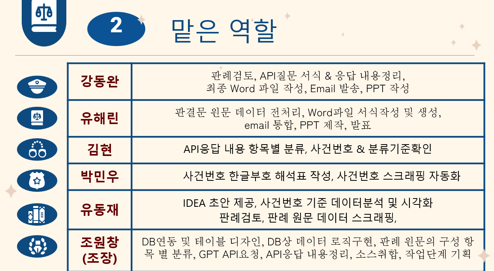
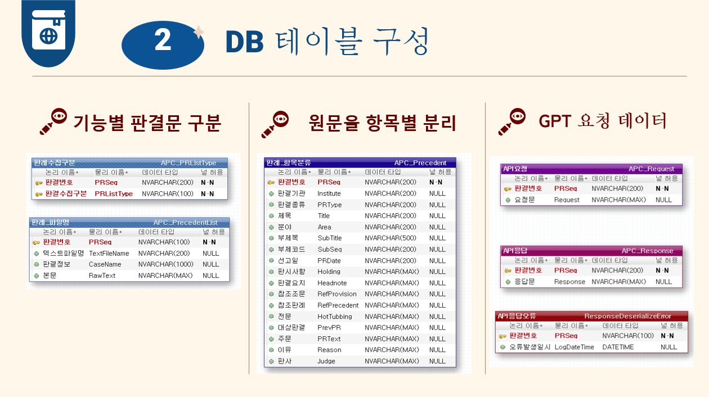
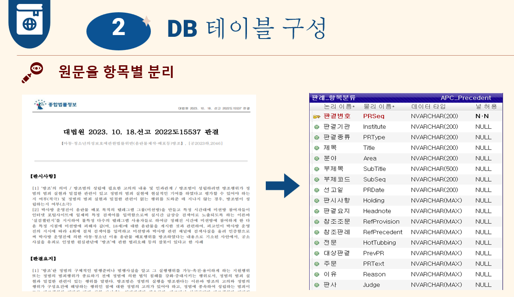
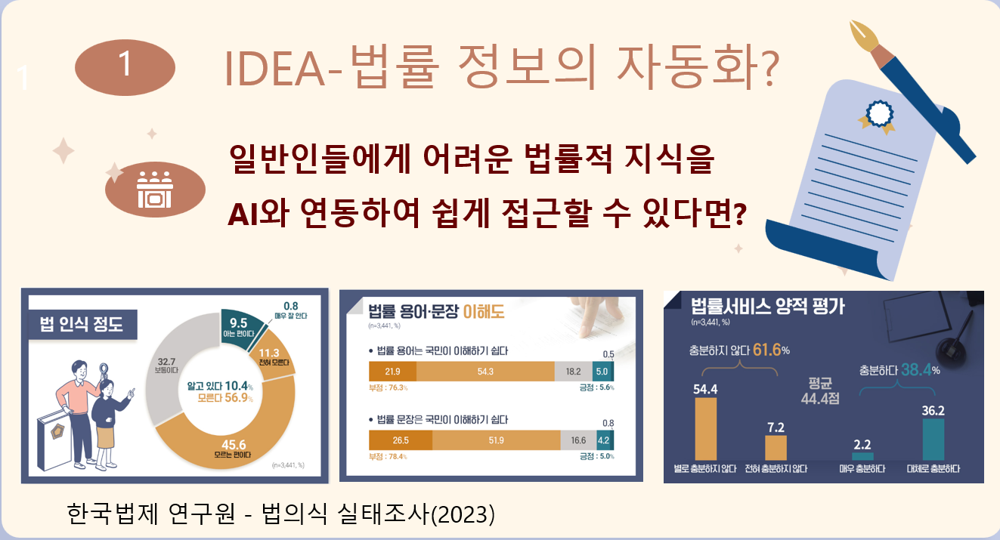
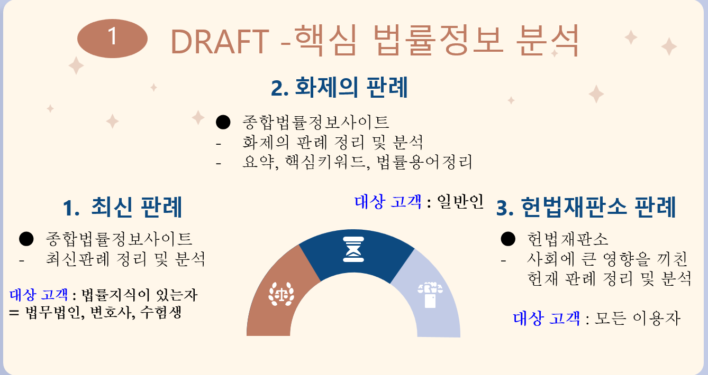
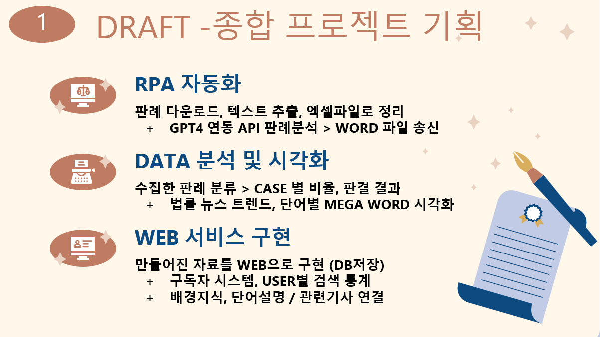

# Alpaco
법률 정보의 자동화 혁신
 (GPT => 판례 분석)

# 🌃 프로젝트 개요

:star: **프로젝트 이름** :   법률 정보의 자동화 혁신 (with GPT)
:clock1: **프로젝트 기간** : 2023.12.14 ~ 2023.12.28 
:department_store: **팀원** : 강동완, 김 현, 박민우, 유동재, 유해린, 조원창, 

## 📘 의도 및 방향
헌재와 대법원 판례와 그 결과들(특히 최신판례)은 오늘날 사회 전반에 있어 
우리나라의 다양한 사회적 관점과 방향을 제시하는 기준이 되고 있다.

하지만 법률적 용어와 개념적 특성상 일반인들은 판결문을 읽어도 내용을 파악하기 어렵고
특히 주기적으로 다양한 분야에 최신판례들이 나오는 만큼 지속적인 시간을 내어 
판례들을 읽고 분석하는 것은 보통의 직장인 & 학생들에게는 아주 힘든 일이다.

우리는 이러한 생각으로 시작해 오늘날 널리 활용되는 챗GPT를 활용해
이용자가 직접 판례를 검색하거나 찾아보지 않더라도, RPA(UI Path)를 활용한 프로그램을 만들어
자동화 (사이트에 접속하고 판례를 읽고 분석하고, 정리해서 요약하는 모든 과정을) 시키고
이 정보들을 일정 주기마다 제공하는 구독 서비스를 기획하였다.

우리 서비스의 목적은 RPA를 활용한 프로그램 실행만으로도 
일정주기마다 헌법 재판소 판례, 대법원 판례들을 GPT의 도움으로 
이용자들에게 제공하는 것이다.
각종 법률용어와 사건의 전개 및 핵심만이 간추려진 정보들을 
주기적으로 받아볼 수 있으며, 이 내용들을 각 사건마다 워드파일로 정리해서
만들어주고, 등록한 이메일로 구독서비스까지 제공하는 것이다.

---------------------------------------------------------------------------------

## 🔨 팀 역할 및 구현
 

## 🗃 DataBase 설계 (ERD)

 
 
APC_Precedent 테이블 내역
Str_PRSeq : 판결코드
Str_Institute : 판결기관
Str_PRType : 판결종류
Str_Title : 제목
Str_SubTitle : 부제목	
Str_SubSeq : 부제코드
Str_PRDate : 선고일
Str_Holing : 판시사항	
Str_Headnote : 판결요지
Str_RefProvision : 참조조문
Str_RefPrecedent : 참조판례
Str_HotTubbing : 전문
Str_PrevPR : 대상판결
Str_PRText : 주문
Str_Reason : 이유
Str_Judge : 판사

# 🎇 아이디어 

## ⛺ 기획 및 기능

--------------------------------------------------------------------------------------

실행 전
*UiPath.PDF.Activities >> 패키지에서 추가 해야 합니다*

대법원 판례 사이트 화제의 판례 페이지에서
각 판례에 대한 PDF를 다운로드 받는 로직입니다.

입력해야할 인수는 아래와 같습니다.

1. 대법원 화제의 판례 페이지 url (Str) >> Invoke_openBrower 인수

2. 다운로드를 받을 폴더(반드시 존재해야됩니다. 실행 전에 생성필요해요) 경로 (Str) >> Invoke_PDF_Download 인수
3. 축출할 판례 개수(Int) >> Invoke_PDF_Download 인수
4. 판례 List를 작성할 DT(빈 DT를 설정해줘도 됩니다) >> Invoke_PDF_Download 인수

===============

Invoke_Step 1-1 에는 필요한 변수를 Assign으로 선언하여 확인하기 쉽도록 만들어놓았습니다.

Invoke_Step 1-1 안에는

Invoke_openBrower, Invoke_PDF_Download가 포함되어 있습니다

실행 후 다운로드 폴더 안에는 다운 받은 판례 PDF 와 List.csv가 생성됩니다.
